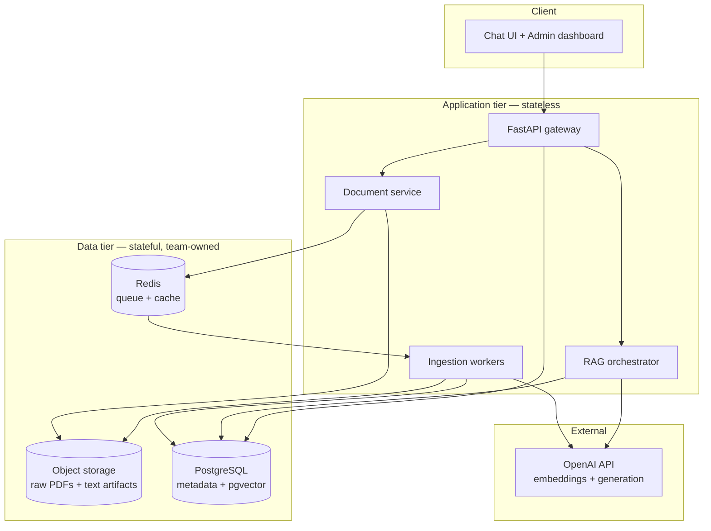

# 1. Architecture

[← Index](README.md) · Next: [Ingestion pipeline →](02-ingestion-pipeline.md)

## 1.1 Goals & principles

- **Source-grounded, not generative-freeform.** Every factual claim traces to a
  book + page. No citation → no claim.
- **Own the data plane.** OpenAI is a stateless generation/embedding dependency;
  all documents, metadata, vectors, and logs live in stores the team controls.
- **Permission-aware retrieval.** Access control is enforced _before_ retrieval,
  not bolted on after, so users only ever see chunks they're allowed to.
- **Stateless app tier, stateful data tier.** API/workers scale horizontally;
  state is in PostgreSQL, object storage, and Redis.
- **Every model id is config.** No provider model name is hardcoded in logic
  (see [validation checklist](README.md#validate-before-locking)).

## 1.2 Logical architecture

## 1.3 Components

| Component | Responsibility | Tech |
|-----------|----------------|------|
| API gateway | HTTP/REST, auth, validation, rate limiting, streaming | FastAPI (async) |
| RAG orchestrator | Query rewrite → filter → hybrid retrieve → rerank → generate → cite | Python service module |
| Document service | Upload, metadata registration, versioning, governance state | FastAPI + PostgreSQL |
| Ingestion workers | Extract → OCR → chunk → embed → upsert (async, resumable) | Celery/RQ on Redis |
| Metadata + vector DB | Relational metadata, ACLs, chunks, embeddings, logs | PostgreSQL + pgvector |
| Object storage | Raw PDFs + extracted/normalized text | S3-compatible (MinIO on-prem / S3/GCS cloud) |
| Cache/queue | Ingestion jobs, response/embedding cache | Redis |
| Observability | Metrics, traces, logs, LLM traces, errors | Prometheus/Grafana, OTel, Sentry |

## 1.4 Two core data flows

**Ingestion (offline, async):** upload → register metadata + license state →
store raw PDF → extract text (OCR fallback) → clean/normalize → detect
structure → chunk with provenance → OpenAI embeddings → upsert vectors +
metadata → ingestion QA → publish. Detail: [02](02-ingestion-pipeline.md).

**Query (online):** authenticate → resolve caller's permission scope → rewrite
query → **apply ACL + metadata pre-filter** → hybrid search (vector + keyword)
→ rerank → pack context → OpenAI generation with citation contract → validate
citations → return answer + sources → log. Detail: [04](04-backend-apis.md).

## 1.5 Why own the stores (the production-control thesis)

| Capability | Requires | Hosted "chat-with-PDF" gives you |
|------------|----------|----------------------------------|
| Citation tracking to page | Own chunk table with page/section provenance | Opaque or coarse |
| Permission filters | Own ACL joined into retrieval query | None / all-or-nothing |
| Book-wise & metadata search | Own metadata columns + indexes | Limited |
| Domain evaluation | Own chunk ids + logs to score retrieval | Not measurable |
| Cost/latency control | Own embedding cache + model pinning | Fixed |

OpenAI stays in scope for exactly two jobs — **embeddings** and **answer
generation** — both stateless calls behind a thin client wrapper
([04](04-backend-apis.md#46-openai-client-wrapper)).

## 1.6 Recommended tech stack

| Layer | Choice | Rationale |
|-------|--------|-----------|
| Backend | FastAPI (Python 3.11+) | Async, matches existing Python scaffold |
| Generation & embeddings | OpenAI API | Per core direction; ids config-driven (validate) |
| Metadata DB | PostgreSQL 16 | Relational + JSONB + full-text + pgvector in one engine |
| Vector DB | pgvector | Co-located with metadata → SQL permission/metadata filtering |
| Vector DB (scale-out) | Qdrant | If vector QPS/scale outgrows pgvector |
| Object storage | MinIO (on-prem) / S3 or GCS (cloud) | Raw PDFs + artifacts |
| Queue/cache | Redis + Celery or RQ | Async ingestion, caching |
| PDF extraction | PyMuPDF (+ pdfplumber/Docling for tables) | Fast text + layout |
| OCR | Tesseract or PaddleOCR | Scanned-page fallback only |
| Frontend | React  | Chat, admin, citation viewer |
| Observability | Prometheus, Grafana, OTel, Sentry | Metrics, traces, errors |

## 1.7 Environments

one isolated environments — **dev** — each with its own
PostgreSQL, object bucket, Redis, and a **separate OpenAI project key** so usage
and spend are attributable and blast radius is contained. See
[06-deployment.md](06-deployment.md).

## 1.8 Scaling notes

- Corpus is modest (~1.2 GB → low-hundreds-of-thousands of chunks); **pgvector
  with HNSW is comfortably sufficient** for launch.
- Ingestion is bursty and CPU/OCR-heavy → scale **workers** independently of the API.
- Generation latency dominates query time → stream responses, cache embeddings,
  keep `top_k`/rerank bounded ([04](04-backend-apis.md)).
- Revisit Qdrant only if vector search QPS or dataset size grows materially
  ([03](03-vector-db-and-data-stores.md#38-when-to-move-off-pgvector)).
