# 2. Ingestion Pipeline

[← Architecture](01-architecture.md) · [Index](README.md) · Next: [Vector DB & data stores →](03-vector-db-and-data-stores.md)

The ingestion pipeline turns an approved PDF into permission-scoped, citable,
embedded chunks. It is **async, idempotent, resumable, and versioned** — a
re-run must never duplicate chunks or silently change what's already published.

## 2.1 Pipeline

```mermaid
flowchart LR
    A[Upload PDF] --> B[Register metadata + license gate]
    B --> C[Store raw PDF in object storage]
    C --> D[Extract text page-wise]
    D --> E{Page has text layer?}
    E -- yes --> G[Use extracted text]
    E -- no --> F[OCR fallback]
    F --> H[Clean + normalize]
    G --> H
    H --> I[Detect chapters / sections]
    I --> J[Chunk with provenance]
    J --> K[OpenAI embeddings - batched]
    K --> L[Upsert chunks + vectors + metadata]
    L --> M[Ingestion QA report]
    M --> N{QA pass?}
    N -- yes --> P[Publish version - searchable]
    N -- no --> Q[Quarantine + human review]
```

## 2.2 Stage-by-stage

| Stage | Input → Output | Notes |
|-------|----------------|-------|
| Register | Upload → `documents` + `document_versions` row | **License gate**: `allowed_for_rag` must be true to proceed ([05](05-security.md#54-data-governance--licensing)). Store checksum. |
| Store raw | File → object storage key | Immutable; keyed by checksum for dedup. |
| Extract | PDF → per-page text | PyMuPDF `get_text()`; keep page number always. |
| OCR fallback | Scanned page → text | Trigger when a page yields < ~40 chars. Rasterize (PyMuPDF pixmap) → Tesseract/PaddleOCR. Flag `is_ocr=true`. |
| Clean | Raw text → normalized | Strip repeated headers/footers, fix hyphenation/line-wrap, drop page furniture. |
| Structure | Text → chapter/section spans | Heading detection; attach `heading_path` to each chunk. |
| Chunk | Sections → chunks | See [§2.4](#24-chunking-rules). |
| Embed | Chunk text → vectors | OpenAI, batched; `input_type=document`; cache by content hash. |
| Upsert | Chunks+vectors → PostgreSQL | Idempotent on stable chunk id ([§2.5](#25-idempotency--versioning)). |
| QA | Version → report | See [§2.6](#26-ingestion-qa-gate). |
| Publish | Version → `status=published` | Only published versions are retrievable. |

## 2.3 Provenance captured per chunk

Everything needed for a citation and for permission/metadata filtering:

`document_id`, `document_version_id`, `source_title`, `author`, `edition`,
`page_start`, `page_end`, `chapter`, `section`, `heading_path`, `chunk_index`,
`token_count`, `domain`, `tags[]`, `is_ocr`, `checksum`, `acl_scope`.

Schema lives in [03-vector-db-and-data-stores.md](03-vector-db-and-data-stores.md#33-schema).

## 2.4 Chunking rules

- Target **500–800 tokens**, **80–120 token overlap** (tune during eval, [07](07-evaluation.md)).
- Split by **section first, then paragraph**; never mid-sentence.
- **Never separate a formula from its explanation**, or a table title from its
  body (critical for NDVI/NDRE/etc. correctness).
- Prepend `heading_path` context to each chunk's embedded text so short chunks
  stay disambiguated.
- Generate a **stable, deterministic chunk id** (e.g. `sha1(document_version_id
  + chunk_index)`), so re-ingestion upserts rather than duplicates.

## 2.5 Idempotency & versioning

- **Document versioning:** a new upload of the same title creates a new
  `document_versions` row; the old version's chunks stay until the new version
  passes QA, then the old version is retired (retrieval filters to the active
  version). No answer is ever served from a half-ingested version.
- **Resumable:** each stage checkpoints (extracted text and embeddings cached in
  object storage / by content hash) so a failed run resumes without re-paying
  OCR or embedding costs.
- **Dedup:** identical checksums are rejected at register; near-duplicate
  _content_ across the overlapping corpus (e.g. the two Lillesand & Kiefer 7th
  eds) is handled at retrieval via source-diversity in reranking ([04](04-backend-apis.md)).

## 2.6 Ingestion QA gate

A version is not published until an automated report passes thresholds:

- **Extraction coverage** — % pages with usable text (native or OCR) ≥ target.
- **OCR ratio** — flag books that are ~100% OCR for manual spot-check.
- **Empty/garbled chunk rate** below threshold.
- **Chunk size distribution** sane (no runaway or sliver chunks).
- **Embedding completeness** — every published chunk has a vector of the
  expected dimension.

Failing versions are **quarantined** for human review, not published.

## 2.7 Corpus-specific handling

| Property | Consequence | Handling |
|----------|-------------|----------|
| Large scans (Bhatta ~390 MB, Anji Reddy ~254 MB) | OCR-heavy, slow, costly | Text-first with OCR fallback; process on workers; resumable checkpoints |
| Overlap/duplicates | Redundant retrieval | Provenance per source + source-diversity rerank |
| Mixed audience folders (`Bsc`/`BTech`) | Not distinct topics | Keep folder as metadata, not as a topic boundary |

## 2.8 Failure handling

- Per-page and per-chunk errors logged with page number; a few bad pages must
  not fail the whole book.
- Failed jobs land on a **dead-letter queue** with the failing stage recorded,
  and are reprocessable from the last checkpoint.
- Ingestion runs are auditable: who uploaded, when, which version, QA outcome
  (feeds the runbook in [08-team-workflow.md](08-team-workflow.md#84-ingestion-runbook)).

## 2.9 Key config knobs

`OCR_MIN_CHARS`, `CHUNK_TOKENS`, `CHUNK_OVERLAP_TOKENS`, `EMBED_BATCH_SIZE`,
`OPENAI_EMBEDDING_MODEL`, `EMBED_DIM` — the last two **pending validation**
([README](README.md#validate-before-locking)).
