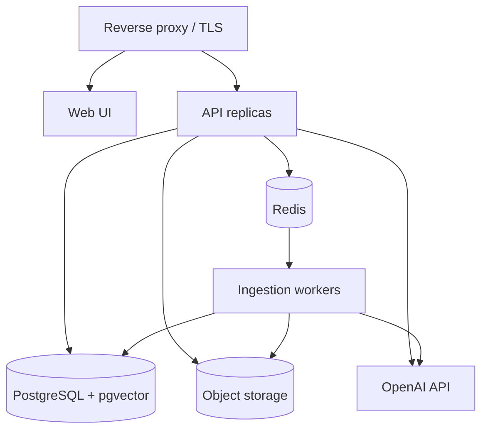

# 6. Deployment

[← Security](05-security.md) · [Index](README.md) · Next: [Evaluation →](07-evaluation.md)

Containerized, reproducible, environment-isolated deployment suitable for
local → staging → on-prem/cloud production, with eval-gated releases.

## 6.1 Environments

| Env | Purpose | Data | OpenAI key |
|-----|---------|------|-----------|
| dev | Local development | Small sample corpus | dev project key |
| staging | Pre-prod validation, eval runs | Full approved corpus (copy) | staging project key |
| prod | Team-facing | Full approved corpus | prod project key |

Each has isolated PostgreSQL, object bucket, Redis, and secrets. Config via env
vars only (twelve-factor); see [appendix §24](appendix-domain-reference.md#24-environment-variables)
— but replace the unverified `gpt-5.5` with the [validated](README.md#validate-before-locking)
model id.

## 6.2 Topology

## 6.3 Containerization

- One image for API + workers (same code, different entrypoint), one for web.
- **Docker Compose** for local/staging/on-prem (services in
  [appendix §23](appendix-domain-reference.md#23-docker-compose-services):
  api, worker, web, postgres `pgvector/pgvector:pg16`, redis, minio, nginx).
- **Kubernetes optional** at scale: API `Deployment` + HPA, workers a separate
  `Deployment` scaled on queue depth, PostgreSQL/Redis/object storage as managed
  services or operators.

## 6.4 Infrastructure as code

Terraform for cloud infra (network, managed PostgreSQL, object storage,
secrets, DNS/TLS). No click-ops for prod. Container images pushed to a registry
and referenced by immutable digest.

## 6.5 CI (on pull request)

1. Install deps · 2. Lint + format · 3. Type-check · 4. Unit tests ·
5. Ingestion + RAG integration tests · 6. **Security scans** (deps + secrets) ·
7. Build images. See [appendix §25](appendix-domain-reference.md#25-cicd-plan).

## 6.6 CD (on merge to main)

1. Build + push images (digest-pinned) · 2. Deploy to **staging** ·
3. Run **DB migrations** (Alembic) · 4. **Run the evaluation suite** and
**gate** on thresholds ([07](07-evaluation.md)) · 5. Smoke-test `/healthz`,
`/readyz`, one chat message (`POST /conversations/{id}/messages`) · 6. Promote
to **prod** (manual approval) with the same
migrate-then-smoke sequence.

Migrations run as an explicit step before app rollout; the fixed `VECTOR(n)`
dimension means **`EMBED_DIM` must be validated before the first migration**
([03 §3.9](03-vector-db-and-data-stores.md#39-sizing-backups-migrations)).

## 6.7 Observability

| Signal | Tool |
|--------|------|
| Metrics (RPS, latency, retrieval/LLM latency, tokens, error rate, empty-retrieval rate, queue depth) | Prometheus + Grafana |
| Traces (request → retrieve → OpenAI) | OpenTelemetry |
| Exceptions | Sentry |
| Structured logs + audit | JSON logs → log store |
| LLM traces (prompt, context, citations, cost) | Trace store / LLM-observability tool |

Metric catalogue: [appendix §20](appendix-domain-reference.md#20-observability-and-monitoring).

## 6.8 Backups & DR

- PostgreSQL: nightly `pg_dump` + WAL archiving (PITR); test restores quarterly.
- Object storage: bucket versioning + offsite copy.
- Re-ingestion is reproducible from raw PDFs + pinned config, so vectors are
  recoverable even without a vector backup.
- Documented RTO/RPO; runbook in [08](08-team-workflow.md).

## 6.9 Cost controls

- Per-request token/cost capture → budget dashboards + alerts.
- Embedding cache (skip re-embedding); bounded `top_k`/`RERANK_TOP_K`; response
  cache for repeated questions.
- Per-env OpenAI spend caps; smaller models where eval shows no quality loss.

## 6.10 Rollout & rollback

- Rolling deploys with health-gated readiness; keep last-known-good image digest.
- **Backward-compatible migrations** (expand-then-contract) so rollback doesn't
  break the schema.
- Feature-flag risky retrieval/generation changes; gate promotion on evals.
