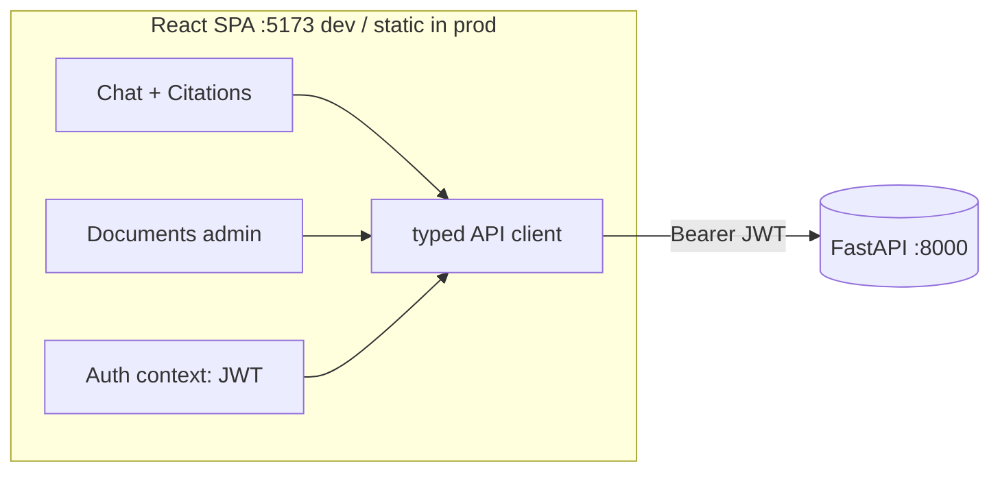

# 9. Frontend (addendum)

[← Index](README.md) · Backend: [04-backend-apis.md](04-backend-apis.md)

Added after the backend was built. Plans the web UI that consumes the API
([docs/api-guide.md](../docs/api-guide.md)).

## 9.1 Recommendation & rationale

**Vite + React + TypeScript** — a single-page app talking to the existing API.

- A RAG chat is streaming + stateful (live tokens, citations panel, history) —
  React hooks fit it directly.
- The product grows beyond chat (document admin, later glossary/evals); a
  component architecture scales, a static HTML page doesn't.
- Vite is fast and build-light; output is static files. Next.js (SSR/routing)
  is unnecessary for an internal single-screen-first tool.

## 9.2 Stack

| Concern | Choice |
|---------|--------|
| Build/dev server | Vite |
| UI | React 18 + TypeScript |
| Styling | plain CSS / CSS modules (add Tailwind later if wanted) |
| Data fetching | native `fetch` (+ `ReadableStream` for SSE) — no heavy client |
| State | React state + Context for auth; revisit only if it grows |
| Markdown render | `react-markdown` (answers may contain lists/formulas) |

Deliberately minimal deps: the streaming and API calls use the platform, not a framework.

## 9.3 Architecture



The SPA is stateless server-side; all state lives in the browser. Every request
carries `Authorization: Bearer <jwt>`.

## 9.4 Backend changes required

1. **CORS** — add `CORSMiddleware` allowing the dev origin (`http://localhost:5173`)
   and the prod origin, with `Authorization` header + the needed methods. (One
   small edit to [api/main.py](../src/akasha/api/main.py).)
2. **(optional) `GET /api/v1/me`** — return the caller's `email`/`is_admin` so the
   UI can show identity and gate the admin screens. Trivial (uses `require_user`).
3. Prod: serve the built static files (nginx, or mount on the API).

## 9.5 Auth

- **Dev:** a login form posts the email to `POST /api/v1/auth/dev-login`
  (enabled by `DEV_AUTH`) and stores the returned JWT (memory / `localStorage`);
  the app attaches it as a Bearer header and shows identity via `GET /me`.
  `401` → clear + re-login.
- **Prod:** OIDC redirect to the `@thaarei.com` IdP ([05](05-security.md)); the
  app receives the JWT and uses it identically. The API layer doesn't change.

## 9.6 Screens & components

**MVP (Phase 1–2):**
- **Chat** — message list, input box, streaming assistant bubble.
- **Citations panel** — the answer's `[S#]` markers → clickable sources showing
  book title + page + score (from the `citations` SSE event / response).
- **Auth gate** — token entry; blocks the app until a valid token is set.

**Later (Phase 3+):**
- **Documents** (admin) — upload PDF, trigger ingest, poll status, list.
- **Glossary**, **Evaluation dashboard** — per [appendix §18](appendix-domain-reference.md#18-frontend-ux-plan).

Component sketch:
```
src/
├── main.tsx, App.tsx
├── auth/            AuthContext, TokenGate
├── api/            client.ts (typed fetch), stream.ts (SSE parser), types.ts
├── chat/           Chat.tsx, MessageList.tsx, Composer.tsx, CitationsPanel.tsx
└── documents/      (Phase 3) DocumentsAdmin.tsx
```

## 9.7 Streaming integration (the core)

`EventSource` can't send an `Authorization` header or POST, so consume the SSE
stream with `fetch` + `ReadableStream` and parse the `event:`/`data:` frames:

```
POST /api/v1/chat  (Accept: text/event-stream, Bearer JWT)
  read chunks → split on "\n\n" → per frame:
    start     → init assistant message (show model)
    delta     → append text token to the live bubble
    citations → render the sources panel ([S#] → book/page)
    usage     → show tokens / TTFT (optional)
    done      → finalize; if insufficient_evidence, style as a refusal
    error     → surface an inline error
```

Non-streaming fallback: `POST /api/v1/chat` with `Accept: application/json`
returns the whole `ChatResponse` at once (useful for tests). Endpoint contracts:
[docs/api-guide.md](../docs/api-guide.md).

## 9.8 API client & types

- A thin `client.ts` wraps `fetch`, injects the Bearer header, and maps non-2xx
  Problem-Details bodies to typed errors.
- `types.ts` mirrors the API schemas (`SearchHit`, `Citation`, `ChatResponse`, …).
  Optionally generate them from `/openapi.json` to stay in sync.

## 9.9 Project layout & build

- Location: `apps/web/` (keeps the monorepo shape from [appendix §22](appendix-domain-reference.md#22-folder-structure)).
- Dev: `npm run dev` (Vite on `:5173`, proxied/CORS to the API on `:8000`).
- Prod: `npm run build` → static `dist/`, served by nginx (or mounted on the API);
  containerized alongside the API ([06](06-deployment.md)).

## 9.10 Phased delivery

| Phase | Deliverable |
|-------|-------------|
| 1 | CORS + token gate + **streaming chat** (send question, watch tokens stream) |
| 2 | **Citations panel** (sources with book + page), markdown answers, refusal state |
| 3 | **Documents admin** (upload → ingest → status), gated by `is_admin` |
| 4 | Polish: history, `/me` identity, error toasts; later glossary/evals |

**First build = Phase 1**: a working streaming chat screen against the live API.
