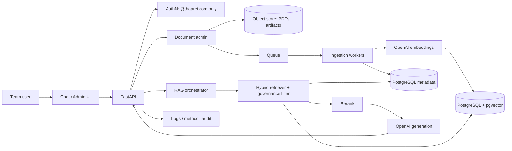

# Akasha GIS/RS RAG — Production Implementation Plan

> **Status:** Draft for review. **Blocking:** the OpenAI **generation** model id
> is still marked _"validate before locking"_ (see [§ Validate before locking](#validate-before-locking)).
> The embedding dimension is now **resolved to 1536** (pgvector index ceiling —
> [03 §3.6](03-vector-db-and-data-stores.md#36-embedding-dimensions--the-pgvector-2000-dim-ceiling-)).

An internal, citation-backed domain assistant that answers Remote Sensing / GIS
and Akasha crop-monitoring questions from an approved corpus, usable by
**`@thaarei.com` employees only**. This plan is organized around eight pillars,
one document each.

## Core direction

Use **OpenAI** for generation and embeddings, but own the data plane for
production control:

- **Own document store** (object storage) — raw PDFs + extracted artifacts.
- **Own metadata DB** (PostgreSQL) — books, chunks, users, citations, logs, audit.
- **Own vector DB** (pgvector in PostgreSQL) — embeddings with SQL-level metadata filtering.

This buys the team **citation tracking**, **single-domain (`@thaarei.com`)
access control**, **book-wise search**, and **domain-specific evaluation** —
none of which a hosted "upload-and-chat" product gives you.

## The eight pillars

| # | Pillar | Document |
|---|--------|----------|
| 1 | Architecture | [01-architecture.md](01-architecture.md) |
| 2 | Ingestion pipeline | [02-ingestion-pipeline.md](02-ingestion-pipeline.md) |
| 3 | Vector DB & data stores | [03-vector-db-and-data-stores.md](03-vector-db-and-data-stores.md) |
| 4 | Backend APIs | [04-backend-apis.md](04-backend-apis.md) |
| 5 | Security | [05-security.md](05-security.md) |
| 6 | Deployment | [06-deployment.md](06-deployment.md) |
| 7 | Evaluation | [07-evaluation.md](07-evaluation.md) |
| 8 | Team workflow | [08-team-workflow.md](08-team-workflow.md) |

**Appendix:** [appendix-domain-reference.md](appendix-domain-reference.md) — the
detailed domain material (glossary backlog, Akasha answer modes, target users,
prompt templates, sample questions). It is an earlier draft kept as reference;
**pillars 01–08 are authoritative where they differ.**

## Access model

There is **no role hierarchy**. Every active `@thaarei.com` employee is an equal
user with full read access to the approved corpus; a single `is_admin` flag
gates corpus administration. Enforced at the IdP, the app (JWT email check), and
the database (`CHECK` constraint). Detail:
[03 §3.3](03-vector-db-and-data-stores.md#33-access-model--thaareicom-employees-only)
· [05 §5.1–5.2](05-security.md#51-authentication--the-thaareicom-gate).

## System at a glance

## Corpus snapshot

10 PDF textbooks, ~1.2 GB, under `Data/` (gitignored):

- `Data/Bsc Agri/` — 6 books (~1.05 GB)
- `Data/BTech Agri/` — 4 books (~145 MB)

Two properties drive ingestion design: several books are **large scans** (OCR
fallback required) and the corpus **overlaps/duplicates** (two Lillesand &
Kiefer 7th eds, two Reddy texts) so dedup + provenance matter. Full list in the
[appendix](appendix-domain-reference.md#5-knowledge-sources).

## Validate before locking

You said you'll confirm current OpenAI RAG/embedding guidance. Every model
choice is a config-driven constant, not a hardcoded assumption:

| Item | Placeholder | Status |
|------|-------------|--------|
| Generation model | `OPENAI_RESPONSE_MODEL` | **OPEN** — confirm current flagship id + context + pricing. (The old draft's `gpt-5.5` is **unverified** — do not ship it.) |
| Embedding model | `OPENAI_EMBEDDING_MODEL` | **OPEN** — pick `text-embedding-3-small` (native 1536) or `3-large` with `dimensions=1536`. Must output **≤ 2000 dims**. |
| Embedding dimensions | `EMBED_DIM` | **RESOLVED = 1536** — pgvector's HNSW/IVFFlat cap is 2000 dims ([03 §3.6](03-vector-db-and-data-stores.md#36-embedding-dimensions--the-pgvector-2000-dim-ceiling-)). Lock before the first migration. |
| Data handling | — | **OPEN** — confirm API retention / no-training posture for the account. |
| Batch/rate limits | — | **OPEN** — embedding batch size + rate limits for ingesting ~1.2 GB. |

## Roadmap (summary)

Phased delivery detail lives in the [appendix, §26](appendix-domain-reference.md#26-implementation-phases).
Short version: **Phase 0** governance/licensing → **Phase 1** local MVP
(1 PDF → cited answer) → **Phase 2** async ingestion + OCR → **Phase 3** hybrid
retrieval + rerank → **Phase 4** UI → **Phase 6** eval gate → **Phase 7**
production hardening.

## Note on the earlier scaffold

The Python scaffold in `src/akasha/` was first written against Voyage/Claude/Chroma.
It has since been converted to **OpenAI** (embeddings + generation); the vector
store still needs converting from Chroma to **PostgreSQL + pgvector**
([03 §3.12](03-vector-db-and-data-stores.md#312-scaffold-changes-required)).
