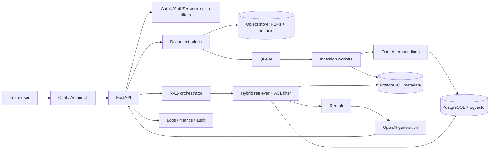

# Akasha GIS/RS RAG — Production Implementation Plan

> **Status:** Draft for review. **Blocking:** OpenAI model/embedding choices are marked _"validate before locking"_ throughout — see [§ Validate before locking](#validate-before-locking). Do not treat model ids/dimensions in these docs as final.

An internal, citation-backed domain assistant that answers Remote Sensing / GIS
and Akasha crop-monitoring questions from an approved corpus. This plan is
organized around eight pillars, one document each.

## Core direction

Use **OpenAI** for generation and embeddings, but own the data plane for
production control:

- **Own document store** (object storage) — raw PDFs + extracted artifacts.
- **Own metadata DB** (PostgreSQL) — books, chunks, users, permissions, citations, logs.
- **Own vector DB** (pgvector in PostgreSQL) — embeddings with SQL-level metadata/permission filtering.

This is what buys the team **citation tracking**, **permission filters**,
**book-wise search**, and **domain-specific evaluation** — none of which a
hosted "upload-and-chat" product gives you.

## The eight pillars

| # | Pillar | Document |
|---|--------|----------|
| 1 | Architecture | [01-architecture.md](01-architecture.md) |
| 2 | Ingestion pipeline | [02-ingestion-pipeline.md](02-ingestion-pipeline.md) |
| 3 | Vector DB & data stores | [03-vector-db-and-data-stores.md](03-vector-db-and-data-stores.md) |
| 4 | Backend APIs | [04-backend-apis.md](04-backend-apis.md) |
| 5 | Security | [05-security.md](05-security.md) |
| 6 | Deployment | [06-deployment.md](06-deployment.md) |
| 7 | Evaluation | [07-evaluation.md](07-evaluation.md) |
| 8 | Team workflow | [08-team-workflow.md](08-team-workflow.md) |

**Appendix:** [appendix-domain-reference.md](appendix-domain-reference.md) — the
detailed domain material (glossary backlog, Akasha answer modes, target users,
prompt templates, sample questions). The pillar docs reference it instead of
duplicating it.

## System at a glance

## Corpus snapshot

10 PDF textbooks, ~1.2 GB, under `Data/` (gitignored):

- `Data/Bsc Agri/` — 6 books (~1.05 GB)
- `Data/BTech Agri/` — 4 books (~145 MB)

Two properties drive ingestion design: several books are **large scans** (OCR
fallback required) and the corpus **overlaps/duplicates** (two Lillesand &
Kiefer 7th eds, two Reddy texts) so dedup + provenance matter. Full list in the
[appendix](appendix-domain-reference.md#5-knowledge-sources).

## Validate before locking

You said you'll confirm current OpenAI RAG/embedding guidance. Resolve these
before the design is frozen; every occurrence in the pillar docs is a
config-driven constant, not a hardcoded assumption:

| Item | Placeholder in docs | To confirm |
|------|--------------------|------------|
| Generation model | `OPENAI_RESPONSE_MODEL` | Current flagship id + context window + pricing. (The old draft's `gpt-5.5` is **unverified** — do not ship it as-is.) |
| Embedding model | `OPENAI_EMBEDDING_MODEL` | Current recommended model + **exact output dimensionality** (drives the `VECTOR(n)` column and index). |
| Embedding dimensions | `EMBED_DIM` | Whether to use full dims or reduced (`dimensions` param) for cost/latency. |
| Data handling | — | API data-retention / no-training posture and any enterprise/zero-retention terms for the account. |
| Batch/rate limits | — | Embedding batch size + rate limits for ingesting ~1.2 GB. |

## Roadmap (summary)

Phased delivery detail lives in the [appendix, §26](appendix-domain-reference.md#26-implementation-phases).
Short version: **Phase 0** governance/licensing → **Phase 1** local MVP
(1 PDF → cited answer) → **Phase 2** async ingestion + OCR → **Phase 3** hybrid
retrieval + rerank → **Phase 4** UI → **Phase 6** eval gate → **Phase 7**
production hardening.

## Note on the earlier scaffold

The Python scaffold in `src/akasha/` was written against an earlier decision
(Voyage embeddings, Claude generation, Chroma store). **This plan supersedes
that**: the target is OpenAI + PostgreSQL/pgvector. When implementation starts,
`src/akasha/config.py`, `index/embed.py`, and `index/store.py` must be updated
accordingly (see [03-vector-db-and-data-stores.md](03-vector-db-and-data-stores.md)).
